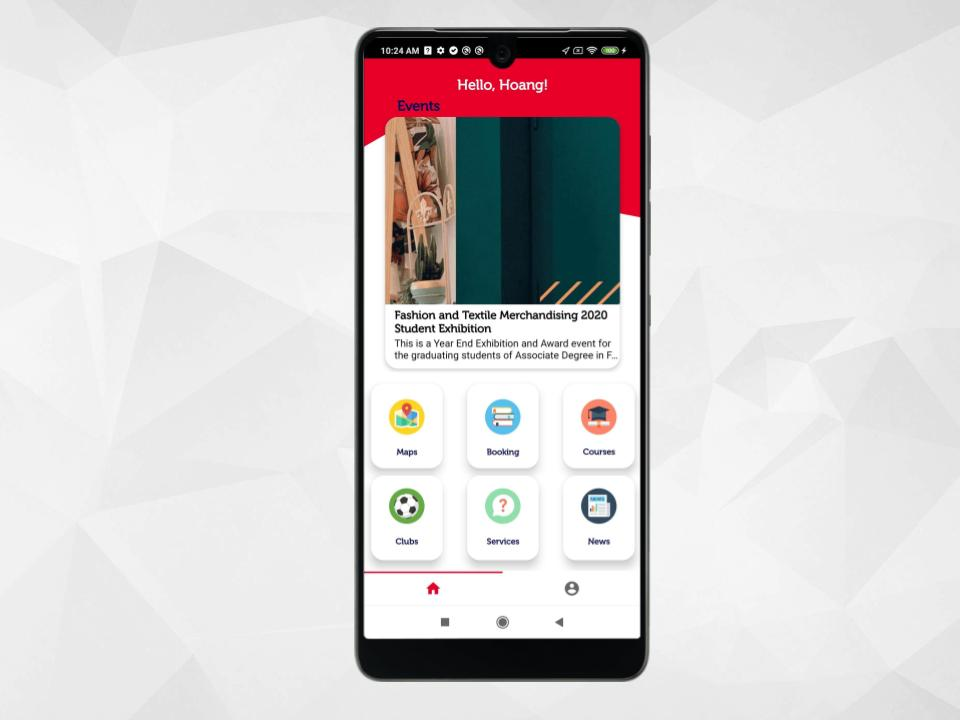
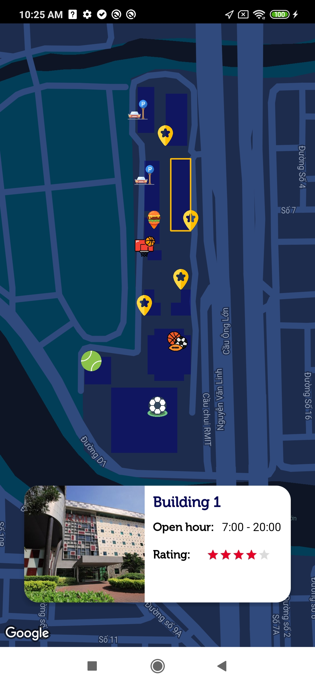
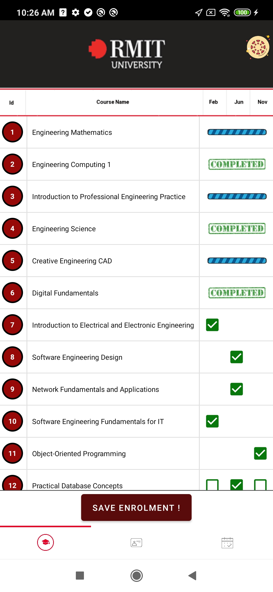
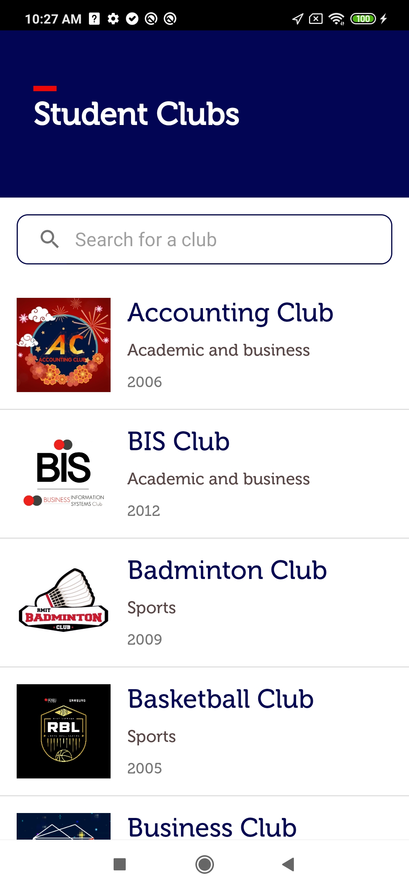
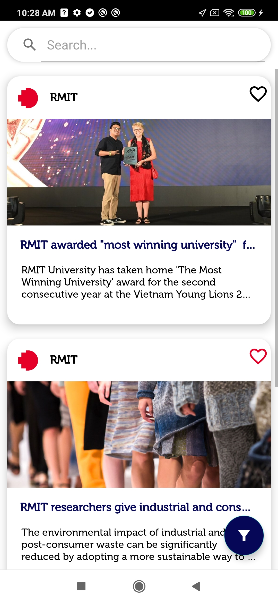

# myRMIT

### Table of Contents
* [Project Description](#description)
* [App screenshots](#screenshots)
* [Credits](#credits)

# Project Description
* **myRMIT** is an Android application that aims to provide the functionalities that would help students at RMIT University to connect with the services and study better
* Some features including:
    * User login and user authentication
    * Student's record
    * Location services
    * Room booking service
    * Course allocation
    * Club information and registration
    * News
    * Contact for different RMIT services
* Full documentation can be found in `doc` folder

## App screenshots

Home screen

Map service

Course allocation

Club information

News feed

## Credits
- [Bao Tran](https://github.com/s3740819)
- [Binh Phan](https://github.com/bmo8699)

